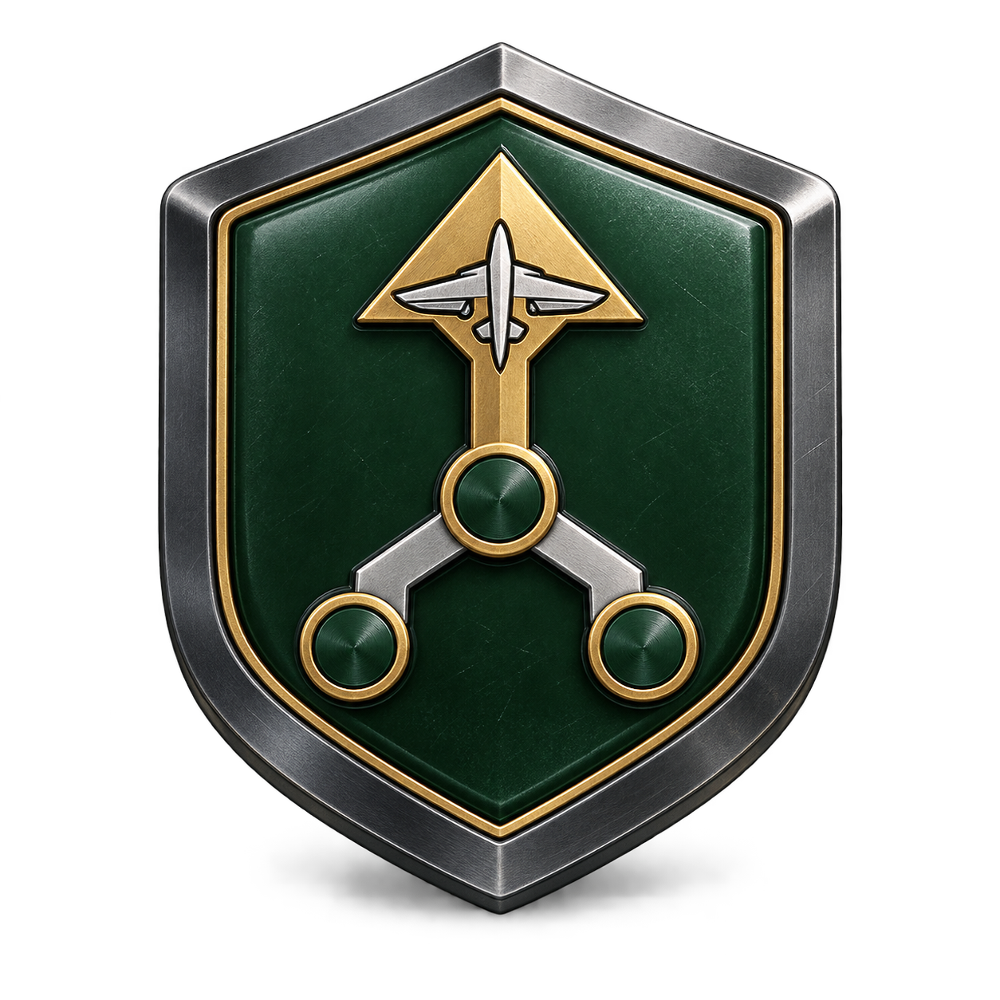
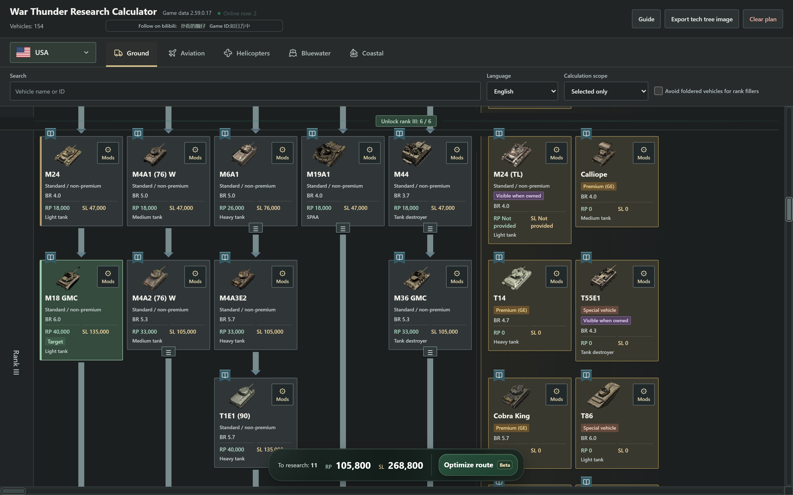
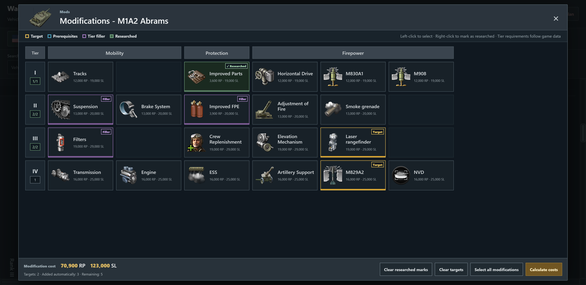

  

<h1 align="center">War Thunder Research Calculator</h1>

Choose your targets. Map your route. Know the RP and Silver Lions you need.

  <a href="https://plastic-time.github.io/K13shot/"><strong>Open Web App</strong></a> &nbsp; · &nbsp;
  <a href="https://github.com/Plastic-time/K13shot/releases/latest"><strong>Download for Windows</strong></a> &nbsp; · &nbsp;
  <a href="https://github.com/Plastic-time/K13shot/releases">Releases</a>

<a href="README.md">简体中文</a> &nbsp; / &nbsp; <strong>English</strong>

3,235 vehicles · 3,225 modification trees · 5 vehicle categories · 7 UI languages

## Plan Your Research Route

**More than a price total.** Set your targets and mark the vehicles you own. The calculator searches for a low-RP route using the current prerequisite and rank-unlock rules, then shows the Silver Lions needed alongside it.

- **Understand each selection**: distinguish targets, waypoints, required vehicles, and rank fillers. Foldered groups show how many vehicles are selected.
- **Adjust the result**: remove a vehicle or mark it as owned without clearing the rest of the route. Run the planner again when you want a new calculation.
- **Keep the budget in view**: see the remaining vehicle count, RP, and Silver Lions in the bottom bar. Export the complete tech tree and its budget as an image.

> Exact Planning is experimental. If the search reaches its computation limit, it returns the best route found, not a guaranteed global optimum. Check the result against the game before researching.

## Build Your Modification Plan

**Research what you need, not necessarily everything.** Open a vehicle's modification window to choose upgrades by category, tier, and prerequisite. Mark completed research, then calculate the remaining requirements.

- **Choose freely**: select one upgrade or several. RP, Silver Lions, and tier counts update immediately.
- **Complete the requirements**: Calculate Modification Research adds prerequisites and tier fillers. Researched items are not charged again.
- **Keep costs separate**: modification costs do not enter the vehicle research total. Upgrades explicitly priced at 0 RP and 0 SL are marked as unlocked.

## Get Started

| Action | Desktop | Mobile |
| --- | --- | --- |
| Select or deselect a vehicle target | Left-click | Tap |
| Set owned status, waypoints, and other roles | Right-click for the menu | Press and hold for about half a second |
| Calculate a route | Select Exact Planning in the bottom bar | Same |
| View vehicle information | Select the Wiki bookmark on the card | Same |

Open the web app to start; no game account is required. On Windows, download the [v1.0.11 portable package](https://github.com/Plastic-time/K13shot/releases/download/v1.0.11/WarThunderResearchCalculator-v1.0.11-portable.zip), extract it, and run `WarThunderResearchCalculator.exe`. No separate Node.js installation is needed. Downloaded packages do not automatically receive later web updates.

Browse ground vehicles, aircraft, helicopters, bluewater fleets, and coastal fleets. The interface and vehicle names support Chinese, English, Russian, German, French, Japanese, and Spanish. This project does not translate third-party Wiki articles.

## Data and Limitations

- **Versioned snapshots**: the overall vehicle-cost baseline is game version **2.59.0.17**, not a live game feed. Game configuration is the primary authority for future cost and prerequisite checks; Wiki provides supplementary names, images, and layout. Existing importers still include legacy sources, so the dataset is not entirely game-config-derived.
- **Scoped corrections**: confirmed Ka-29 and Do 217 J-2 corrections remain in place. Version 1.0.11 uses configuration **2.59.0.34** to set GLBC mk.3 on both CA-27 variants to **9,000 RP / 14,000 SL**. This is not a full snapshot upgrade.
- **Unknown is not free**: missing prices are shown as unavailable, not zero. Rank-unlock counts still use the project's separate rules table; verify your route in the game.
- **Plans stay in your browser**: selections and plans are not uploaded or synced between devices. Images, Wiki pages, and the web-only online counter require a connection. The counter estimates active browsers; a counter outage does not prevent calculations.

Development, maintenance, and further reading

- [Local setup and data maintenance](doc/development.md) (Chinese)
- [Server configuration and update permissions](doc/server-security.md) (Chinese)
- [Online counter rules](doc/online-counter.md) (Chinese)
- [Modification artwork sources](doc/ammunition-artwork.md) (Chinese)
- [Vehicle snapshot manifest](docs/database/manifest.json) · [Modification audit](tools/modifications-audit.json)
- [v1.0.11 notes](doc/release-v1.0.11.md) (Chinese) · [All releases](https://github.com/Plastic-time/K13shot/releases)

---

An unofficial, player-made tool. Not affiliated with Gaijin Entertainment. Game names, vehicle images, and other third-party assets belong to their respective owners.

bilibili: 扑街的靓仔 &nbsp; · &nbsp; In-game ID: 如日方中

