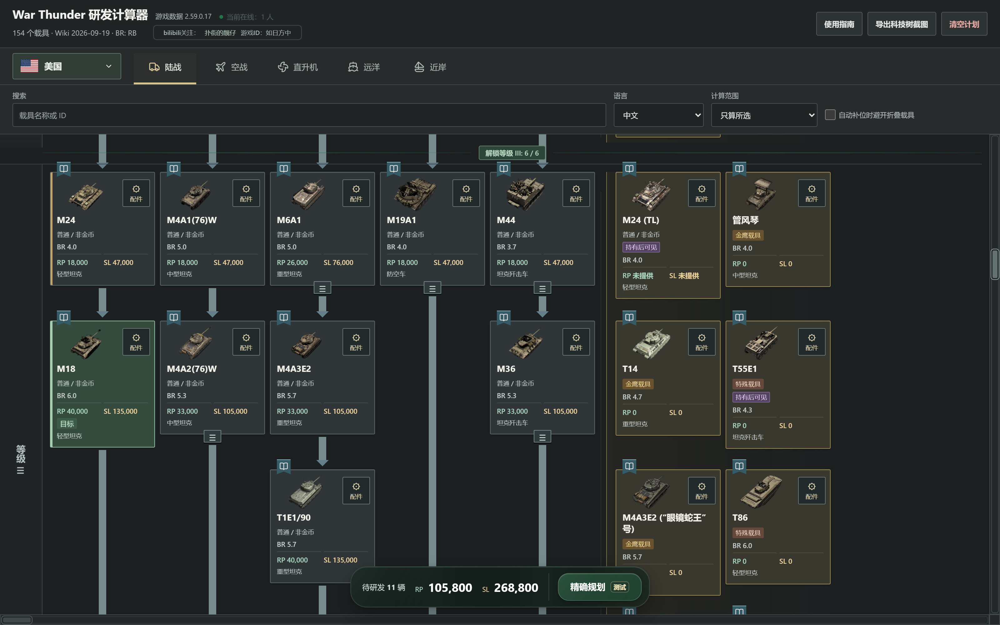
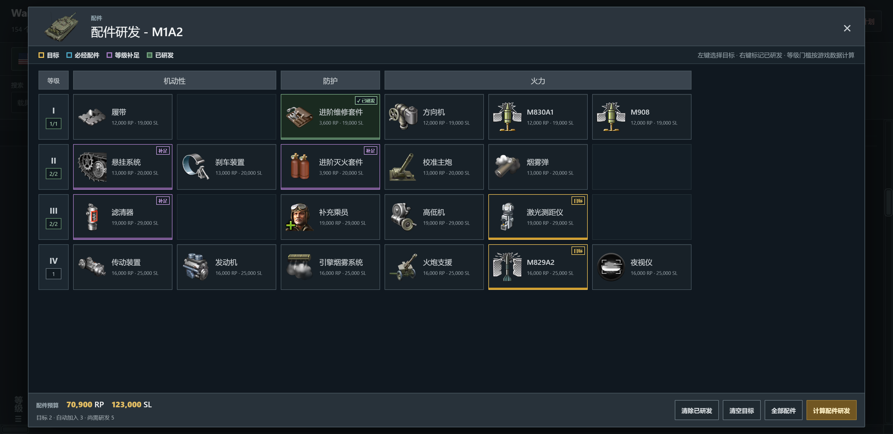

  

<h1 align="center">War Thunder 研发计算器</h1>

选好目标，看清路线，算好每一步的研发点与银狮。

  <a href="https://plastic-time.github.io/K13shot/"><strong>打开网页版</strong></a> &nbsp; · &nbsp;
  <a href="https://github.com/Plastic-time/K13shot/releases/latest"><strong>下载 Windows 版</strong></a> &nbsp; · &nbsp;
  <a href="https://github.com/Plastic-time/K13shot/releases">更新记录</a>

<strong>简体中文</strong> &nbsp; / &nbsp; <a href="README.en.md">English</a>

3,235 辆载具 · 3,225 套配件树 · 5 类军种 · 7 种界面语言

## 自动规划研发路线

**不只是把价格相加。** 选定目标、标记已拥有的载具，计算器会结合当前前置关系和等级解锁数量，搜索低 RP 路线，并显示需要准备的银狮。

- **分清每辆车的用途**：目标、途经点、必经载具和等级补足分别显示，折叠组也能查看已选数量。
- **规划后仍可调整**：单独取消一辆车或标记已拥有，不会清空整条路线；再次规划时再重新计算。
- **看清完整预算**：底部显示待研发数量、RP 与银狮；可将完整科技树连同预算导出为图片。

> 精确规划为测试功能。搜索达到本机计算上限时，结果是当前找到的最佳路线，不保证全局最优；实际研发前请在游戏内核对。

## 定制配件研发

**只开需要的配件，也能算清楚。** 打开载具的配件窗口，按类别、等级与前置关系选择目标，记录已研发项目，再让计算器补齐必要条件。

- **自由选择**：选择一个或多个配件，RP、银狮和等级数量即时更新。
- **按条件补齐**：点击“计算配件研发”，加入必经配件和等级补足；已研发项目不重复收费。
- **独立预算**：配件费用不混入载具研发总计；明确为 0 RP、0 SL 的配件直接显示“已解锁”。

## 开始使用

| 操作 | 电脑 | 手机 |
| --- | --- | --- |
| 选择或取消载具目标 | 左键点击 | 轻点 |
| 设置已拥有、途经点等状态 | 右键打开菜单 | 长按约半秒 |
| 自动计算路线 | 点击底部“精确规划” | 同左 |
| 查看载具资料 | 点击卡片上的 Wiki 小书签 | 同左 |

网页版直接打开即可，无需游戏账号。Windows 用户下载 [v1.0.11 便携包](https://github.com/Plastic-time/K13shot/releases/download/v1.0.11/WarThunderResearchCalculator-v1.0.11-portable.zip)，解压后运行 `WarThunderResearchCalculator.exe`，不需要另外安装 Node.js。下载包不会自动获得之后的网页更新。

支持陆战、空战、直升机、远洋与近岸舰队；界面及载具名称支持中文、英语、俄语、德语、法语、日语和西班牙语。第三方 Wiki 正文不由本项目翻译。

## 数据与边界

- **固定快照**：整体载具费用基准为游戏 **2.59.0.17**，不是与游戏实时同步。游戏配置是后续费用和前置核对的主要依据，Wiki 用于补充名称、图片和布局；现有导入流程仍有历史数据来源，不能视为全量纯游戏配置。
- **局部修正单独记录**：Ka-29、Do 217 J-2 保留已确认修正；v1.0.11 按 **2.59.0.34** 配置将两架 CA-27 的 GLBC mk.3 调整为 **9,000 RP / 14,000 SL**，不代表整体快照升级。
- **未知不是免费**：缺失费用显示“未提供”，不当作 0。等级解锁数量还使用项目独立规则表，规划结果需结合游戏核对。
- **计划留在浏览器**：选择和规划不上传、不跨设备同步。图片、Wiki 和网页版在线人数需要联网；在线人数是浏览器估计值，统计异常不影响计算。

开发、维护与更多说明

- [本地运行与数据维护](doc/development.md)
- [服务器配置与更新权限](doc/server-security.md)
- [在线人数统计规则](doc/online-counter.md)
- [配件图标来源](doc/ammunition-artwork.md)
- [载具快照清单](docs/database/manifest.json) · [配件核对记录](tools/modifications-audit.json)
- [v1.0.11 更新说明](doc/release-v1.0.11.md) · [全部版本](https://github.com/Plastic-time/K13shot/releases)

---

由玩家制作的非官方工具，与 Gaijin Entertainment 无隶属关系。游戏名称、载具图片等素材的权利归各自权利人所有。

bilibili：扑街的靓仔 &nbsp; · &nbsp; 游戏 ID：如日方中

